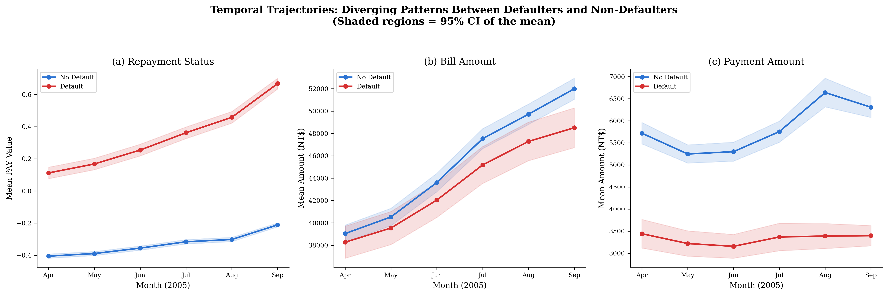
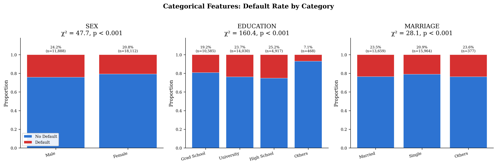
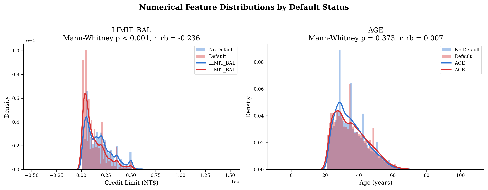
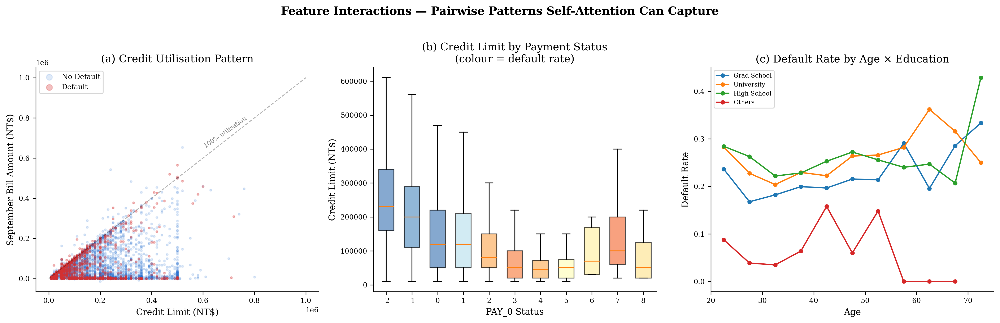
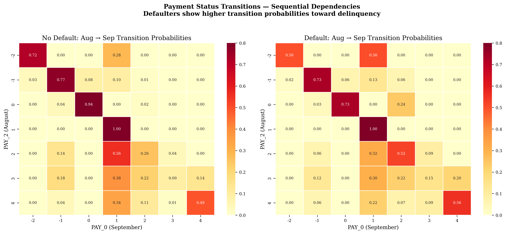

<div align="center">

# Credit Default Prediction with a Tabular Transformer

### Self-Attention on Structured Credit Data vs. Random Forest Baseline

[](https://python.org)
[](https://python-poetry.org)
[](https://scikit-learn.org)
[](LICENSE)

<br>

*Does self-attention over temporal payment sequences improve credit default prediction compared to tree-based methods? This project explores that question using the UCI Taiwan Credit Card dataset.*

<br>

[Overview](#overview) · [Roadmap](#project-roadmap) · [Key Findings](#key-eda-findings) · [Structure](#repository-structure) · [Getting Started](#getting-started) · [EDA Gallery](#exploratory-data-analysis-gallery) · [Data Ingestion](#resilient-data-ingestion) · [Pipeline](#preprocessing-pipeline) · [References](#references)

---

</div>

<br>

## Overview

This project develops two models for predicting credit card default on the [UCI Credit Card Default dataset](https://archive.ics.uci.edu/dataset/350/default+of+credit+card+clients) (30,000 clients, 23 features):

1. **A transformer-based model built from scratch** --- the core deliverable, using explicit self-attention over tokenised tabular records
2. **A tuned Random Forest** --- the benchmark for comparison

The dataset contains **6 monthly snapshots** of payment behaviour (April--September 2005) per client. The EDA in this repository reveals clear temporal divergence between defaulters and non-defaulters, motivating a sequence-aware architecture.

> This repository currently contains **Steps 0--3, Step 4 (partial: encoder landed, full model next), and Step 5**. The training loop, evaluation framework, and experiments are in subsequent PRs.

### Dataset

| Property | Value |
|:---|:---|
| **Source** | [UCI ML Repository](https://archive.ics.uci.edu/dataset/350/default+of+credit+card+clients) |
| **Records** | 30,000 clients |
| **Features** | 23 (5 demographic, 6 repayment status, 6 bill amounts, 6 payment amounts) |
| **Target** | Binary --- default payment next month (22.1% positive rate) |
| **Temporal span** | 6 monthly snapshots (April--September 2005) |
| **Class imbalance** | 3.5 : 1 (non-default : default) |
| **Reference** | Yeh & Lien (2009). *Expert Systems with Applications*, 36(2), 2473--2480 |

<br>

## Project Roadmap

| Step | Phase | Status | Description |
|:---:|:---|:---:|:---|
| **0** | Resilient Data Ingestion | `DONE` | Layered, provenance-aware loader: UCI ML Repository API with bounded retries, automatic fallback to a tracked offline `.xls`, every consumer routes through it. |
| **1** | Exploratory Data Analysis | `DONE` | 12 figures with statistical tests. Temporal divergence, PAY semantics, feature importance, multicollinearity, outlier and normality diagnostics. |
| **2** | Data Preprocessing | `DONE` | Schema normalisation, categorical cleaning, 22 engineered features, stratified 70/15/15 split, leak-free scaling, tokeniser metadata export. |
| **3** | Tabular Tokenisation | `DONE` | Hybrid PAY state+severity tokenisation (Novelty N1) in [`src/tokenizer.py`](src/tokenizer.py); feature embedding with [CLS], optional temporal positional encoding, and MTLM `[MASK]` support in [`src/embedding.py`](src/embedding.py). |
| **4** | Transformer (From Scratch) | `PARTIAL` | Attention ([`src/attention.py`](src/attention.py), PR #7 + `attn_bias` hook PR #8) and PreNorm encoder ([`src/transformer.py`](src/transformer.py), PR #8 — `FeedForward`, `TransformerBlock`, `TemporalDecayBias` Novelty N3, `TransformerEncoder`) landed. Top-level `TabularTransformer` wrapper in [`src/model.py`](src/model.py) and supervised training loop in [`src/train.py`](src/train.py) are next. |
| **5** | Random Forest Benchmark | `DONE` | Hyperparameter-tuned Random Forest on engineered features. 60-iter RandomizedSearchCV, dual importance, threshold optimisation. |
| **6** | Experiments & Comparison | `TODO` | Metrics (AUC-ROC, F1, precision-recall), attention visualisation, ablation studies, calibration, statistical significance, limitations. |

<br>

## Key EDA Findings

These findings directly motivate the architectural decisions in Steps 3--4.

<table>
<tr>
<td width="50%">

### 1. Temporal Divergence
Defaulters and non-defaulters show **diverging 6-month trajectories** in repayment status, bill amounts, and payment amounts. This is the primary justification for a sequence-aware model rather than treating features as an unordered set.

</td>
<td width="50%">



</td>
</tr>
<tr>
<td width="50%">


</td>
<td width="50%">

### 2. PAY Dual Semantics
PAY values have **two distinct zones**: categorical (-2, -1, 0 = no bill / paid / revolving) and ordinal (1+ = months delayed). The default rate jumps non-linearly from 12% at PAY=0 to 60%+ at PAY>=2. This motivates a hybrid tokenisation scheme.

</td>
</tr>
<tr>
<td width="50%">

### 3. Feature Importance Hierarchy
**PAY status features dominate** (|r| up to 0.33), while BILL_AMT features show high inter-temporal autocorrelation (r > 0.9). The temporal *pattern* matters more than individual values.

</td>
<td width="50%">


</td>
</tr>
<tr>
<td width="50%">


</td>
<td width="50%">

### 4. Class Imbalance
**3.5:1 imbalance** (22.1% default). A naive majority-class classifier achieves 78% accuracy. This requires class-weighted loss and evaluation via AUC-ROC and F1 rather than accuracy.

</td>
</tr>
</table>

<br>

## Repository Structure

```
credit-default-tabular-transformer/
│
├── pyproject.toml              # Poetry configuration and dependencies
├── poetry.lock                 # Locked dependency versions
├── run_pipeline.py             # CLI entry point (EDA, preprocessing, RF benchmark)
│
├── notebooks/
│   ├── 01_exploratory_data_analysis.ipynb   # Full EDA with statistical tests
│   ├── 02_data_preprocessing.ipynb          # Preprocessing pipeline walkthrough
│   └── 03_random_forest_benchmark.ipynb     # RF training, tuning, evaluation, importance
│
├── src/
│   ├── __init__.py
│   ├── data_sources.py         # Resilient multi-source loader (UCI API → local fallback)
│   ├── data_preprocessing.py   # Data loading, cleaning, engineering, splitting, scaling
│   ├── eda.py                  # 12 publication-quality visualisations
│   └── random_forest.py        # RF benchmark: tuning, evaluation, importance, figures
│
├── data/
│   ├── raw/                    # Dataset source (manual fallback .xls is tracked)
│   │   └── default_of_credit_card_clients.xls   # Offline fallback dataset
│   └── processed/              # Pipeline outputs
│       ├── feature_metadata.json    # Category mappings for tokeniser
│       └── validation_report.json   # Data quality audit
│
├── figures/                    # EDA + RF figures (300 DPI)
│
├── results/                    # Summary statistics + RF results (CSV, JSON, LaTeX)
│
└── docs/
    └── coursework_spec.md      # Assignment specification
```

<br>

## Getting Started

### Prerequisites

| Requirement | Version | Check |
|:---|:---|:---|
| Python | 3.9+ | `python3 --version` |
| Poetry | 2.0+ | `poetry --version` |

If Poetry is not installed:

```bash
curl -sSL https://install.python-poetry.org | python3 -
```

### Installation

```bash
git clone https://github.com/abailey81/credit-default-tabular-transformer.git
cd credit-default-tabular-transformer
poetry install
```

> **Poetry 2.0+:** The `poetry shell` command was removed. Use `poetry run <command>` instead.

### Data Loading

By default, the dataset is fetched from the UCI ML Repository API. If the
API is unavailable, the loader **automatically falls back** to the
locally-tracked manual dataset
[`data/raw/default_of_credit_card_clients.xls`](data/raw/default_of_credit_card_clients.xls)
--- so the entire pipeline (EDA, preprocessing, Random Forest benchmark,
notebooks) runs out of the box on a fresh clone, even with no network access.

See [Resilient Data Ingestion](#resilient-data-ingestion) below for the full
architecture, source modes, and programmatic API.

### Run the Pipeline

```bash
# Full pipeline (EDA + preprocessing)
poetry run python run_pipeline.py

# EDA only
poetry run python run_pipeline.py --eda-only

# Preprocessing only
poetry run python run_pipeline.py --preprocess-only

# Random Forest benchmark (training + tuning + evaluation)
poetry run python run_pipeline.py --rf-benchmark

# Force a specific data source
poetry run python run_pipeline.py --source api      # UCI API only
poetry run python run_pipeline.py --source local    # Local manual dataset only
poetry run python run_pipeline.py --no-fallback     # auto mode without local fallback

# Pin to a specific local file
poetry run python run_pipeline.py --data-path "data/raw/default_of_credit_card_clients.xls"
```

### Notebooks

```bash
poetry run jupyter notebook notebooks/
```

| Notebook | Description |
|:---|:---|
| `01_exploratory_data_analysis.ipynb` | 20+ visualisations, statistical tests (Wilson CI, KS, Mann-Whitney U, Cohen's d, Cramer's V, D'Agostino, VIF, mutual information) |
| `02_data_preprocessing.ipynb` | Cleaning, validation, feature engineering, stratified splitting, scaling, metadata export |
| `03_random_forest_benchmark.ipynb` | Baseline vs tuned RF, hyperparameter analysis, feature importance (Gini + permutation), threshold optimisation, cross-validation |

<br>

## Exploratory Data Analysis Gallery

The EDA pipeline produces **12 figures**, each with a statistical test and an insight that feeds into modelling decisions.

<details>
<summary><b>Fig 01 --- Class Distribution</b></summary>
<br>

<br><br>
3.5:1 imbalance (22.1% default). Stratified splitting preserves this ratio. Class-weighted loss is essential.
</details>

<details>
<summary><b>Fig 02 --- Categorical Features by Default Status</b></summary>
<br>

<br><br>
All three categorical features (SEX, EDUCATION, MARRIAGE) show statistically significant association with default (chi-squared, p < 0.001).
</details>

<details>
<summary><b>Fig 03 --- Numerical Distributions</b></summary>
<br>

<br><br>
Defaulters have significantly lower credit limits (Mann-Whitney p < 0.001, r_rb = 0.15). Age shows weak discrimination.
</details>

<details>
<summary><b>Fig 04 --- PAY Status Semantic Analysis</b></summary>
<br>

<br><br>
Dual-zone structure: categorical {-2, -1, 0} vs ordinal delinquency {1--8}. Default rate jumps non-linearly from 12% to 60%+ at PAY >= 2.
</details>

<details>
<summary><b>Fig 05 --- Temporal Trajectories</b></summary>
<br>

<br><br>
Clear 6-month divergence between defaulters and non-defaulters across all three feature groups. Primary justification for sequence-aware modelling.
</details>

<details>
<summary><b>Fig 06 --- Credit Utilisation</b></summary>
<br>

<br><br>
Defaulters show consistently higher credit utilisation. Over-limit (>100%) is a strong default signal.
</details>

<details>
<summary><b>Fig 07 --- Correlation Heatmap</b></summary>
<br>

<br><br>
BILL_AMT features are highly autocorrelated (r > 0.9 for adjacent months). PAY features show the strongest correlation with the target.
</details>

<details>
<summary><b>Fig 08 --- Feature-Target Association</b></summary>
<br>

<br><br>
PAY_0 is the strongest single predictor (|r| = 0.33). Recent PAY features are more predictive than distant ones.
</details>

<details>
<summary><b>Fig 09 --- Bill Amount Autocorrelation</b></summary>
<br>

<br><br>
Autocorrelation decays differently for defaulters vs non-defaulters. Attention can learn these distinct temporal patterns.
</details>

<details>
<summary><b>Fig 10 --- Feature Interactions</b></summary>
<br>

<br><br>
Non-linear interactions between credit limit, utilisation, and delinquency status.
</details>

<details>
<summary><b>Fig 11 --- PAY Transition Probabilities</b></summary>
<br>

<br><br>
Defaulters show higher probability of escalating delinquency (e.g., PAY 0 to 2). Sequential transition dynamics differ between classes.
</details>

<details>
<summary><b>Fig 13 --- Repayment Ratio</b></summary>
<br>

<br><br>
Defaulters consistently repay a smaller fraction of their bill across all 6 months.
</details>

<br>

## Resilient Data Ingestion

The dataset is loaded through [`src/data_sources.py`](src/data_sources.py),
a layered, provenance-aware ingestion abstraction. Every consumer of the
data --- the EDA module, the preprocessing pipeline, the Random Forest
benchmark, and the notebooks --- delegates to it, so the same fallback
semantics apply to the entire project.

### Architecture

```
                  ┌──────────────────────────────────────┐
                  │      ChainedDataSource (auto mode)    │
                  │  ┌────────────────┐ ┌─────────────┐  │
                  │  │ UCIRepoSource  │→│ LocalExcel- │  │
                  │  │ (3x retries +  │  │ Source      │  │
                  │  │ exp. backoff)  │  │ (fallback)  │  │
                  │  └────────────────┘  └─────────────┘  │
                  └───────────────────┬──────────────────┘
                                      v
                            DataSourceResult
                            (df + provenance)
```

### Components

| Class | Role |
|:---|:---|
| `DataSource` (ABC) | Abstract base — every source implements `name` and `load()`. |
| `UCIRepoSource` | Fetches via the `ucimlrepo` package; retries up to **3** times with exponential backoff before raising. |
| `LocalExcelSource` | Reads from a list of candidate `.xls`/`.xlsx` paths; resolves relative paths against both the cwd and the repository root. |
| `ChainedDataSource` | Tries each child source in order, accumulating failures into the result so the fallback chain is fully auditable. |
| `DataSourceResult` | Frozen dataclass carrying the dataframe, source name, source type, origin URI, elapsed time, and the list of failed attempts. |
| `DataIngestionError` | Raised only when *every* configured source has failed. |
| `build_default_data_source(...)` | Factory used by the rest of the codebase. Honours an explicit `data_path` as a hard pin (never silently hits the network). |

### Source modes

| Mode | Behaviour |
|:---|:---|
| `auto` *(default)* | Try the UCI API first; on failure, fall back automatically to the local manual dataset. |
| `api` | UCI API only. Failures propagate as a hard error. |
| `local` | Local manual dataset only --- never contacts the network. |
| `--no-fallback` | In `auto` mode, disables the local fallback so any UCI failure becomes a hard error. |
| `--data-path FILE` | Pin to a specific `.xls`/`.xlsx` file. Bypasses the chain entirely. |

The manual fallback dataset
[`data/raw/default_of_credit_card_clients.xls`](data/raw/default_of_credit_card_clients.xls)
is **tracked in the repository** so the offline path always works on a fresh
clone, even with no network access.

### Programmatic use

```python
from data_sources import build_default_data_source

source = build_default_data_source(mode="auto", allow_fallback=True)
result = source.load()

print(result.summary())
# loaded 30,000 rows × 25 cols from UCI ML Repository (id=350) (...) in 1.42s
# or, on fallback:
# loaded 30,000 rows × 25 cols from Local fallback dataset (...) in 1.38s
#   [after fallback from: UCI ML Repository (id=350)]

df = result.dataframe
for failed_name, err in result.failed_attempts:
    print(f"  ↳ fell back from '{failed_name}': {err}")
```

`DataSourceResult` always tells you exactly where the data came from --- the
source name, the origin URI, the wall-clock duration of the load, and the
chain of failed attempts (if any) that triggered the fallback.

<br>

## Preprocessing Pipeline

```
                  ┌─────────────────────────────────┐
                  │   ChainedDataSource (auto mode) │
                  │ ┌─────────────┐ ┌─────────────┐ │
                  │ │ UCI API     │→│ Local .xls  │ │
                  │ │ (3 retries) │ │ (fallback)  │ │
                  │ └─────────────┘ └─────────────┘ │
                  └────────────────┬────────────────┘
                                   v
       Schema Normalisation ──> Categorical Cleaning ──> Validation
                                                              │
    ┌─────────────────────────────────────────────────────────┘
    v
Feature Engineering (22 features) ──> Stratified Split (70/15/15)
    │                                        │
    v                                        v
 Engineered CSVs                  Fit StandardScaler (train only)
 (for Random Forest)                        │
                                            v
                                 Apply to val/test (no leakage)
                                            │
                                            v
                                  Export: CSVs + JSON metadata
```

### Processing Steps

| Step | Operation | Detail |
|:---|:---|:---|
| **Ingestion** | Multi-source loader with fallback | UCI API (3x retries) → local `.xls` fallback; provenance reported via `DataSourceResult` |
| **Schema** | Normalise column names | `PAY_1` to `PAY_0`, drop `ID` |
| **Cleaning** | Merge undocumented codes | `EDUCATION {0,5,6}` to `4`, `MARRIAGE {0}` to `3` |
| **Validation** | Data quality audit | 0 missing values, 35 duplicates (0.12%), all ranges valid |
| **Engineering** | 22 derived features | Utilisation ratios, repayment ratios, delinquency aggregates, bill slope |
| **Splitting** | Stratified three-way | 22.12% default rate preserved in all splits |
| **Scaling** | StandardScaler (train only) | Applied to val/test without leakage |
| **Metadata** | JSON export | Category mappings and feature statistics for tokeniser |

### Engineered Features

| Group | Count | Description |
|:---|:---:|:---|
| `UTIL_RATIO_1--6` | 6 | Credit utilisation per month |
| `REPAY_RATIO_1--6` | 6 | Repayment fraction per month |
| Delinquency aggregates | 5 | Delay count, max delay, trend, no-use months |
| Bill dynamics | 2 | Linear slope, average utilisation |
| Payment dynamics | 2 | Average payment, payment volatility |
| Balance totals | 1 | Aggregate payment-to-bill ratio |

<br>

## Random Forest Benchmark

The RF benchmark (`src/random_forest.py`) provides a strong tree-based baseline for comparison against the Transformer. It reuses the **shared preprocessing pipeline** to ensure identical data transformations.

### Pipeline

```
Shared Pipeline (data_preprocessing.py)
    │
    ├── ChainedDataSource (UCI API → local .xls fallback)
    ├── Normalise → Clean → Engineer (45 features)
    └── Stratified Split (70/15/15)
                │
                v
        Baseline RF (100 trees, defaults)
                │
                v
        RandomizedSearchCV (60 iter × 5-fold CV)
                │
                v
        Tuned RF → Evaluate (val + test)
                │
    ┌───────────┼───────────────────────┐
    v           v                       v
5-fold CV   Feature Importance    Threshold Optimisation
            (Gini + Permutation)  (max F1 on val set)
    │           │                       │
    v           v                       v
Results:  rf_metrics.csv, rf_feature_importance.csv,
          rf_cross_validation.csv, rf_config.json
Figures:  rf_roc_pr_curves.png, rf_confusion_matrix.png,
          rf_feature_importance.png, rf_threshold_analysis.png,
          rf_tuning_analysis.png
```

### Hyperparameter Search Space

| Parameter | Values | Rationale |
|:---|:---|:---|
| `n_estimators` | 100, 200, 300, 500 | Ensemble size vs compute trade-off |
| `max_depth` | 5, 10, 15, 20, None | Bias--variance control |
| `min_samples_split` | 2, 5, 10 | Split regularisation |
| `min_samples_leaf` | 1, 2, 4 | Leaf-level smoothing |
| `max_features` | sqrt, log2 | Tree decorrelation |
| `class_weight` | None, balanced, balanced_subsample | Class imbalance handling |

<br>

## References

1. Yeh, I.C. & Lien, C.H. (2009). The comparisons of data mining techniques for the predictive accuracy of probability of default of credit card clients. *Expert Systems with Applications*, 36(2), 2473--2480.
2. Vaswani, A., et al. (2017). Attention Is All You Need. *NeurIPS*.
3. Gorishniy, Y., et al. (2021). Revisiting Deep Learning Models for Tabular Data. *NeurIPS*.
4. Huang, X., et al. (2020). TabTransformer: Tabular Data Modeling Using Contextual Embeddings. *arXiv:2012.06678*.

<br>

---

<div align="center">

<sub>UCL MSc Coursework</sub>

</div>
