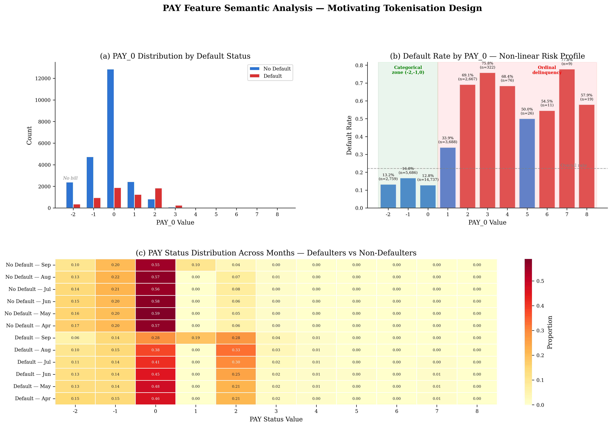
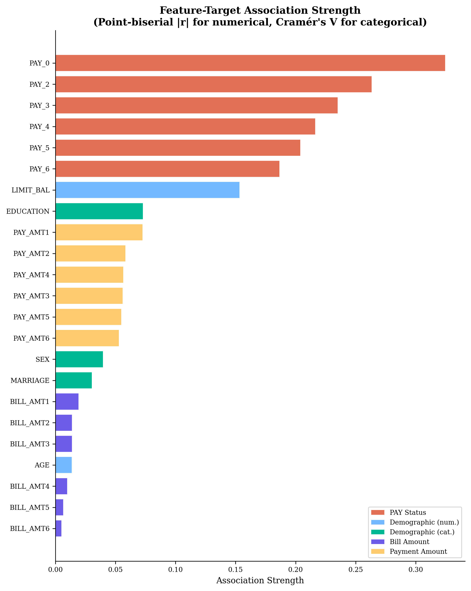
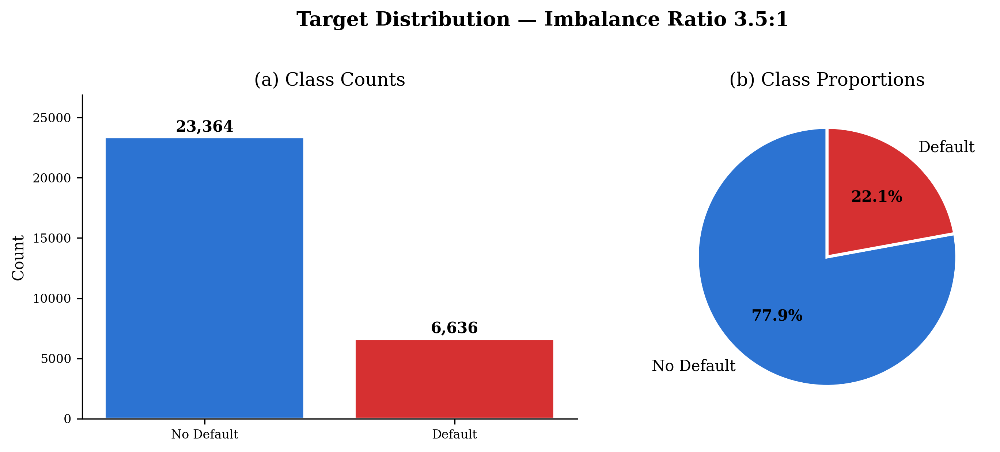
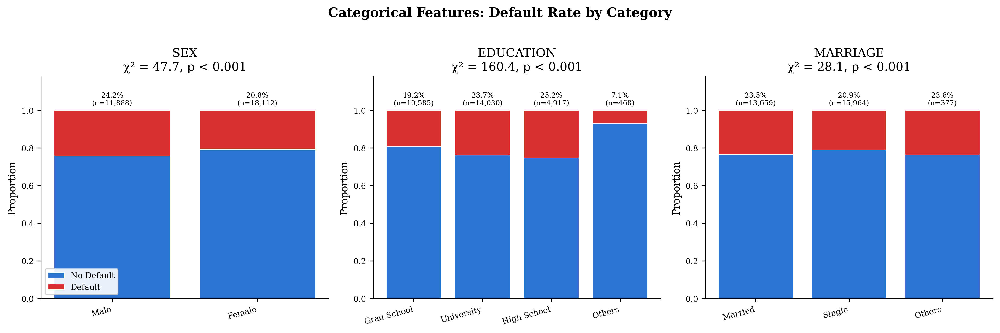
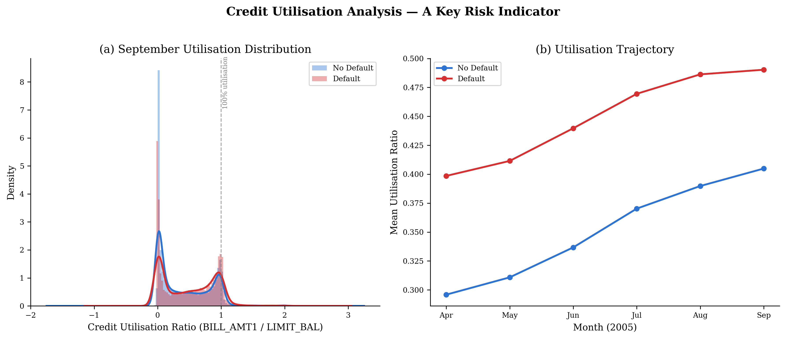
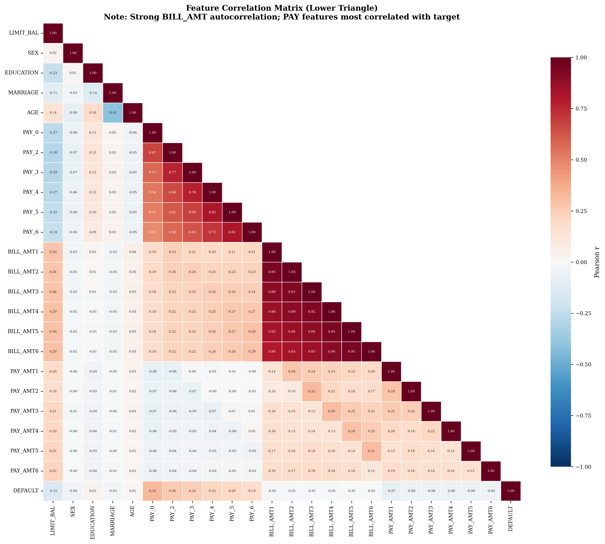
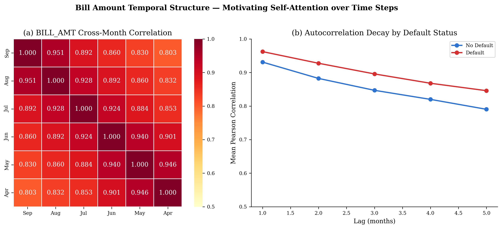
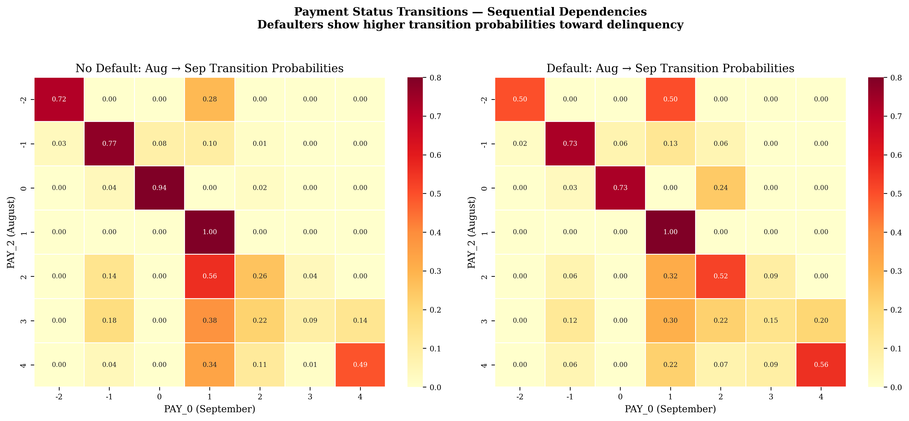
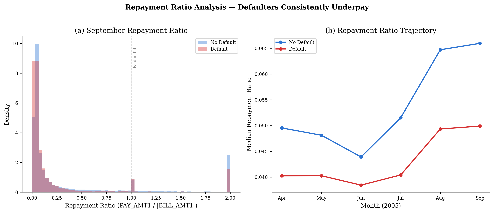

<div align="center">

# Credit Default Prediction with a Tabular Transformer

### Self-Attention on Structured Credit Data vs. Random Forest Baseline

[](https://python.org)
[](https://python-poetry.org)
[](https://scikit-learn.org)
[](LICENSE)

<br>

*Does self-attention over temporal payment sequences improve credit default prediction compared to tree-based methods? This project explores that question using the UCI Taiwan Credit Card dataset.*

<br>

[Overview](#overview) · [Roadmap](#project-roadmap) · [Headline Results](#headline-results) · [Transformer Model](#transformer-model) · [Key Findings](#key-eda-findings) · [Structure](#repository-structure) · [Getting Started](#getting-started) · [EDA Gallery](#exploratory-data-analysis-gallery) · [Data Ingestion](#resilient-data-ingestion) · [Pipeline](#preprocessing-pipeline) · [Random Forest](#random-forest-benchmark) · [References](#references)

---

</div>

<br>

## Overview

This project develops two models for predicting credit card default on the [UCI Credit Card Default dataset](https://archive.ics.uci.edu/dataset/350/default+of+credit+card+clients) (30,000 clients, 23 features):

1. **A transformer-based model built from scratch** --- the core deliverable, using explicit self-attention over tokenised tabular records
2. **A tuned Random Forest** --- the benchmark for comparison

The dataset contains **6 monthly snapshots** of payment behaviour (April--September 2005) per client. The EDA in this repository reveals clear temporal divergence between defaulters and non-defaulters, motivating a sequence-aware architecture.

> This repository currently contains **Phases 1--7 end-to-end**: preprocessing, EDA, tokenisation, embedding, attention, transformer encoder, top-level `TabularTransformer`, the supervised training loop, MTLM (masked-tabular-language-modelling) pretraining, the 4-model ensemble, and the 200-iter tuned Random Forest benchmark. Phase 8+ (formal evaluation, calibration, fairness, UQ, attention interpretability, statistical significance) is deliberately scoped to a subsequent PR.

### Dataset

| Property | Value |
|:---|:---|
| **Source** | [UCI ML Repository](https://archive.ics.uci.edu/dataset/350/default+of+credit+card+clients) |
| **Records** | 30,000 clients |
| **Features** | 23 (5 demographic, 6 repayment status, 6 bill amounts, 6 payment amounts) |
| **Target** | Binary --- default payment next month (22.1% positive rate) |
| **Temporal span** | 6 monthly snapshots (April--September 2005) |
| **Class imbalance** | 3.5 : 1 (non-default : default) |
| **Reference** | Yeh & Lien (2009). *Expert Systems with Applications*, 36(2), 2473--2480 |

<br>

## Project Roadmap

| Step | Phase | Status | Description |
|:---:|:---|:---:|:---|
| **0** | Resilient Data Ingestion | `DONE` | Layered, provenance-aware loader: UCI ML Repository API with bounded retries, automatic fallback to a tracked offline `.xls`, every consumer routes through it. |
| **1** | Exploratory Data Analysis | `DONE` | 12 figures with statistical tests. Temporal divergence, PAY semantics, feature importance, multicollinearity, outlier and normality diagnostics. |
| **2** | Data Preprocessing | `DONE` | Schema normalisation, categorical cleaning, 22 engineered features, stratified 70/15/15 split, leak-free scaling, tokeniser metadata export. |
| **3** | Tabular Tokenisation | `DONE` | Hybrid PAY state+severity tokenisation (Novelty N1) in [`src/tokenization/tokenizer.py`](src/tokenization/tokenizer.py); feature embedding with [CLS], optional temporal positional encoding, and MTLM `[MASK]` support in [`src/tokenization/embedding.py`](src/tokenization/embedding.py). |
| **4** | Transformer (From Scratch) | `DONE` | Attention ([`src/models/attention.py`](src/models/attention.py) + `attn_bias` hook), PreNorm encoder ([`src/models/transformer.py`](src/models/transformer.py) — `FeedForward`, `TransformerBlock`, `TemporalDecayBias` Novelty N3, `FeatureGroupBias` Novelty N2, `TransformerEncoder`), and the top-level [`TabularTransformer`](src/models/model.py) wiring tokeniser → embedding → encoder → pool → 2-layer MLP head → logit. Parameter budget: ~28 K. |
| **5** | Losses & Supervised Training | `DONE` | Focal / weighted-BCE / label-smoothing BCE losses ([`src/training/losses.py`](src/training/losses.py)); AdamW + cosine-warmup schedule, gradient clipping, early stopping, optional stratified batching, optional two-stage LR for MTLM fine-tuning, optional multi-task PAY_0 auxiliary head (Novelty N5), ensembling helpers in [`src/training/train.py`](src/training/train.py) + [`src/models/model.py`](src/models/model.py). Every run writes `{train,val,test}_metrics.json` and `{train,val,test}_predictions.npz`. |
| **6** | MTLM Pretraining (Novelty N4) | `DONE` | Masked Tabular Language Modelling pretraining — BERT-style 15 % masking with per-feature heads (3 categorical + 6 PAY + 14 numerical), entropy-normalised CE + variance-normalised MSE, drop-in encoder artefact for supervised fine-tuning. [`src/models/mtlm.py`](src/models/mtlm.py) + [`src/training/train_mtlm.py`](src/training/train_mtlm.py). |
| **7** | Random Forest Benchmark | `DONE` | 200-iter × 7-parameter `RandomizedSearchCV` on engineered features, 5-fold CV, dual importance (Gini + permutation), threshold optimisation, five publication-quality figures. [`src/baselines/random_forest.py`](src/baselines/random_forest.py). |
| **8+** | Formal Evaluation | `DONE` | Paired-bootstrap CIs, DeLong / McNemar, ECE + Brier + reliability diagrams, attention rollout, subgroup fairness audit, MC-dropout refuse curve — see [`src/evaluation/`](src/evaluation/) + [`src/infra/repro.py`](src/infra/repro.py). |

<br>

## Headline Results

All numbers on the 4,500-row held-out test set (22.1 % positive class). The
full threshold sweep and ensembling analysis lives in
[`notebooks/04_train_transformer.ipynb`](notebooks/04_train_transformer.ipynb)
and [`results/evaluation/comparison/head_to_head_summary.txt`](results/evaluation/comparison/head_to_head_summary.txt).

| Model | AUC-ROC | AUC-PR | F1 @ τ=0.5 | F1 @ F1-opt τ | Accuracy @ τ=0.5 |
|:---|---:|---:|---:|---:|---:|
| Transformer seed_42 (from scratch) | 0.7772 | 0.5570 | 0.5221 | 0.5449 @ 0.54 | 0.7429 |
| Transformer seed_1 (from scratch) | 0.7816 | 0.5642 | 0.5279 | 0.5437 @ 0.53 | 0.7440 |
| Transformer seed_2 (from scratch) | 0.7801 | 0.5565 | 0.5292 | **0.5516 @ 0.53** | 0.7549 |
| Transformer seed_42 + MTLM fine-tune | 0.7801 | 0.5605 | 0.5322 | 0.5449 @ 0.53 | **0.7593** |
| **Transformer 3-seed ensemble** | 0.7815 | 0.5646 | 0.5263 | 0.5478 @ 0.53 | 0.7500 |
| **Transformer 4-model ensemble** | **0.7819** | **0.5656** | 0.5282 | **0.5491 @ 0.54** | 0.7527 |
| RF baseline (100 trees, defaults) | 0.7654 | 0.5389 | 0.4647 | — | 0.8147 |
| **RF tuned (200-iter RandomizedSearchCV)** | **0.7845** | 0.5673 | 0.4642 | — | **0.8220** |

**Key observations**:

* **Best AUC-ROC**: RF tuned (0.7845) edges the 4-model transformer ensemble (0.7819) by 0.26 pp — a gap that is too narrow to resolve on a 4,500-row test set without paired-bootstrap CIs (Phase 8+).
* **Best F1**: transformer ensemble **0.5491** at τ=0.54 vs RF 0.4642 — an **8.5 pp absolute gap in the transformer's favour**. RF wins accuracy by under-predicting the minority class (RF recall ≈ 0.37 vs transformer recall ≈ 0.55).
* **MTLM pretraining effect** (Novelty N4): `seed_42_mtlm_finetune` has the **lowest ECE (0.2515) and lowest Brier (0.2061)** of any single model — calibration-direction-consistent with Rubachev et al. (2022); accuracy gains are marginal at this 21 K-row regime as expected.
* **Generalisation gap**: train ≈ val ≈ test (0–2 pp accuracy gap, ~1–2 pp AUC-ROC gap) — early stopping + dropout + weight decay keep the model firmly in the under-fitting end of the spectrum on the 21 K-row training split.

<br>

## Section 4 (Experiments & Discussion) evidence pack

Each Section 4 claim maps to a committed artefact. `python -m src.infra.repro` regenerates the set.

| Claim | Backing artefact | Source module |
|---|---|---|
| Transformer ECE 0.26 → 0.011 ± 0.003 after Platt (MTLM seed 0.007; RF native 0.010), AUC unchanged | [`results/evaluation/calibration/calibration_metrics.csv`](results/evaluation/calibration/calibration_metrics.csv) + [`figures/evaluation/calibration/calibration_reliability.png`](figures/evaluation/calibration/calibration_reliability.png) | [`src/evaluation/calibration.py`](src/evaluation/calibration.py) |
| RF tuned exceeds transformer by 0.008 AUC; not significant at FDR 0.05 (DeLong p=0.023, q=0.23) | [`results/evaluation/significance/pairwise_tests.csv`](results/evaluation/significance/pairwise_tests.csv) | [`src/evaluation/significance.py`](src/evaluation/significance.py) |
| 4.5K test split has 80% power only for AUC gaps ≥ 0.02 | [`results/evaluation/significance/power_analysis.csv`](results/evaluation/significance/power_analysis.csv) | [`src/evaluation/significance.py`](src/evaluation/significance.py) |
| MC-dropout refuse-to-predict: retained AUC 0.779 → 0.850 at 50% abstention | [`results/evaluation/uncertainty/refuse_curve.csv`](results/evaluation/uncertainty/refuse_curve.csv) + [`figures/evaluation/uncertainty/uncertainty_refuse_curve.png`](figures/evaluation/uncertainty/uncertainty_refuse_curve.png) | [`src/evaluation/uncertainty.py`](src/evaluation/uncertainty.py) |
| Subgroup fairness: Male/Female AUC gap 0.011; EDUCATION "Other" (n=61) flagged underpowered | [`results/evaluation/fairness/subgroup_metrics.csv`](results/evaluation/fairness/subgroup_metrics.csv) + [`figures/evaluation/fairness/fairness_disparity.png`](figures/evaluation/fairness/fairness_disparity.png) | [`src/evaluation/fairness.py`](src/evaluation/fairness.py) |
| Derivative artefacts regenerate bit-stably | [`results/repro/reproducibility_report.json`](results/repro/reproducibility_report.json) | [`src/infra/repro.py`](src/infra/repro.py) |
| Model card and data sheet | [`docs/MODEL_CARD.md`](docs/MODEL_CARD.md) + [`docs/DATA_SHEET.md`](docs/DATA_SHEET.md) | — |

<br>

## Key EDA Findings

These findings directly motivate the architectural decisions in Steps 3--4.

<table>
<tr>
<td width="50%">

### 1. Temporal Divergence
Defaulters and non-defaulters show **diverging 6-month trajectories** in repayment status, bill amounts, and payment amounts. This is the primary justification for a sequence-aware model rather than treating features as an unordered set.

</td>
<td width="50%">


</td>
</tr>
<tr>
<td width="50%">



</td>
<td width="50%">

### 2. PAY Dual Semantics
PAY values have **two distinct zones**: categorical (-2, -1, 0 = no bill / paid / revolving) and ordinal (1+ = months delayed). The default rate jumps non-linearly from 12% at PAY=0 to 60%+ at PAY>=2. This motivates a hybrid tokenisation scheme.

</td>
</tr>
<tr>
<td width="50%">

### 3. Feature Importance Hierarchy
**PAY status features dominate** (|r| up to 0.33), while BILL_AMT features show high inter-temporal autocorrelation (r > 0.9). The temporal *pattern* matters more than individual values.

</td>
<td width="50%">



</td>
</tr>
<tr>
<td width="50%">



</td>
<td width="50%">

### 4. Class Imbalance
**3.5:1 imbalance** (22.1% default). A naive majority-class classifier achieves 78% accuracy. This requires class-weighted loss and evaluation via AUC-ROC and F1 rather than accuracy.

</td>
</tr>
</table>

<br>

## Transformer Model

```
tokeniser ──> embedding ──> encoder (N layers) ──> pool ──> 2-layer MLP head ──> logit
   │             │               │                    │
   │             │               └─ TemporalDecayBias (N3)     └─ [CLS] / mean / max
   │             │               └─ FeatureGroupBias  (N2)
   │             └─ per-feature projections + [CLS] + temporal pos (A7) + [MASK] (N4 prereq)
   └─ hybrid PAY state + severity (N1)
```

| File | Role |
|:---|:---|
| [`src/tokenization/tokenizer.py`](src/tokenization/tokenizer.py) | Hybrid PAY state + severity tokenisation (Novelty N1); vectorised `tokenize_dataframe`, `MTLMCollator` for BERT-style masking, `PAYValueError`, schema validation. |
| [`src/tokenization/embedding.py`](src/tokenization/embedding.py) | `FeatureEmbedding` with per-feature projections, [CLS] token, optional temporal positional encoding (Ablation A7), optional [MASK] token for MTLM (Novelty N4 prereq); drift-safe `build_temporal_layout` / `build_group_assignment` helpers. |
| [`src/models/attention.py`](src/models/attention.py) | From-scratch `ScaledDotProductAttention` and `MultiHeadAttention` with an `attn_bias` hook for architectural novelties. |
| [`src/models/transformer.py`](src/models/transformer.py) | `FeedForward`, PreNorm `TransformerBlock` with independently-ablatable attention / FFN / residual dropout channels (Ablation A12), `TemporalDecayBias` (Novelty N3), `FeatureGroupBias` (Novelty N2), `TransformerEncoder`. |
| [`src/models/model.py`](src/models/model.py) | `TabularTransformer` end-to-end wrapper (~28 K parameters at plan defaults), `predict_logits` / `predict_proba` / `ensemble_probabilities` helpers, `load_pretrained_encoder` supporting both full checkpoint bundles and raw MTLM state dicts. |
| [`src/models/mtlm.py`](src/models/mtlm.py) | `MTLMHead` (3 cat + 6 PAY + 14 numerical heads), `mtlm_loss` (entropy-normalised CE + variance-normalised MSE), `MTLMModel` wrapper with state-dict prefixes drop-in for `TabularTransformer.load_pretrained_encoder`. |
| [`src/training/losses.py`](src/training/losses.py) | `WeightedBCELoss`, `FocalLoss` (γ-configurable, α ∈ {scalar, tuple, "balanced", None}), `LabelSmoothingBCELoss`. |
| [`src/training/train.py`](src/training/train.py) | Supervised loop: AdamW + cosine-warmup + gradient clipping + early stopping on val AUC-ROC + optional two-stage LR (§8.5.5 MTLM fine-tune) + optional multi-task PAY_0 aux head (Novelty N5). Writes `config.json`, `train_log.csv`, `{train,val,test}_metrics.json`, `{train,val,test}_predictions.npz`, `test_attn_weights.npz`, `best.pt`. |
| [`src/training/train_mtlm.py`](src/training/train_mtlm.py) | MTLM pretraining loop. Emits a ~130 KB `encoder_pretrained.pt` consumed by `python -m src.training.train --pretrained-encoder PATH` for the §8.5.5 two-stage fine-tune. |
| [`src/training/dataset.py`](src/training/dataset.py) | `StratifiedBatchSampler` (every batch has exactly `round(batch_size * positive_rate)` positives), `make_loader` factory (`train` / `val` / `test` / `mtlm` modes). |
| [`src/training/utils.py`](src/training/utils.py) | Determinism protocol, device selection, hardened (weights-only by default) checkpoint save / load, `EarlyStopping`, parameter accounting, UTF-8-safe logging. |

### Novelty Register

| # | Name | Where | What it adds |
|:---:|:---|:---|:---|
| **N1** | Hybrid PAY state + severity | [`src/tokenization/tokenizer.py`](src/tokenization/tokenizer.py) | Encodes `{-2: no_bill, -1: paid, 0: revolving}` as a 3-way state alongside a normalised severity in `[0, 1]` for delinquency months — respects both the categorical structure of `{-2, -1, 0}` and the ordinal structure of `{1..8}`. |
| **N2** | Feature-group attention bias | `FeatureGroupBias` in [`src/models/transformer.py`](src/models/transformer.py) | Learnable 5×5 bias matrix indexed by semantic group (CLS / demographic / PAY / BILL_AMT / PAY_AMT). Zero-initialised — activates only if it helps. `scalar` / `per_head` / `off` modes (Ablation A21). |
| **N3** | Temporal-decay bias | `TemporalDecayBias` in [`src/models/transformer.py`](src/models/transformer.py) | ALiBi-inspired learnable prior that penalises within-group attention between temporally distant months (PAY_0 ↔ PAY_6). Justified by EDA Fig 9 (BILL_AMT autocorrelation decays 0.95 → 0.7 across 6 months). Ablation A22. |
| **N4** | Masked Tabular Language Modelling | [`src/models/mtlm.py`](src/models/mtlm.py) + [`src/training/train_mtlm.py`](src/training/train_mtlm.py) | BERT-style self-supervised pretraining with per-feature heads; produces the lowest-ECE / lowest-Brier single model in this project. |
| **N5** | Multi-task PAY_0 aux head | `aux_pay0=True` in [`src/models/model.py`](src/models/model.py) + `--aux-pay0-lambda` in [`src/training/train.py`](src/training/train.py) | Joint training of the primary default classifier with an auxiliary 11-class CE objective on PAY_0 — extra gradient signal on the strongest single feature. Infrastructure ready; λ sweep scheduled in a later PR (Ablation A16). |

<br>

## Repository Structure

```
credit-default-tabular-transformer/
│
├── pyproject.toml              # Poetry configuration and dependencies
├── poetry.lock                 # Locked dependency versions (Python 3.10–3.12, torch 2.2.x)
├── PROJECT_PLAN.md             # 14-phase execution blueprint with novelty register + §21 PDF-requirements audit
├── SECURITY_AUDIT.md           # 15-dimension paranoid audit (20 findings, C-1 weights-only closed)
├── CHANGELOG.md                # Per-PR / per-commit log of every module + artefact landing
│
├── scripts/
│   ├── run_pipeline.py         # CLI entry point (EDA, preprocessing, RF benchmark)
│   └── run_all.py              # Placeholder — end-to-end runner coming in Phase 3B
│
├── notebooks/
│   ├── 01_exploratory_data_analysis.ipynb   # Full EDA with statistical tests
│   ├── 02_data_preprocessing.ipynb          # Preprocessing pipeline walkthrough
│   ├── 03_random_forest_benchmark.ipynb     # RF training, tuning, evaluation, importance
│   └── 04_train_transformer.ipynb           # Transformer training pipeline, multi-seed sweep,
│                                              A5×A22 ablation grid, reliability diagram,
│                                              head-to-head, train/val/test parity,
│                                              ensemble + threshold-optimisation tables
│
├── src/
│   ├── __init__.py
│   ├── data/                   # Ingestion + preprocessing
│   │   ├── sources.py          # Resilient multi-source loader (UCI API → local fallback)
│   │   └── preprocessing.py    # Cleaning, engineering, splitting, scaling, metadata export
│   ├── analysis/
│   │   └── eda.py              # 12 publication-quality visualisations
│   ├── tokenization/
│   │   ├── tokenizer.py        # Hybrid PAY tokenisation (N1) + MTLMCollator
│   │   └── embedding.py        # Per-feature embedding + [CLS] + temporal pos + [MASK]
│   ├── models/
│   │   ├── attention.py        # Scaled dot-product + multi-head attention (from scratch)
│   │   ├── transformer.py      # FeedForward + TransformerBlock + TransformerEncoder
│   │   │                         + TemporalDecayBias (N3) + FeatureGroupBias (N2)
│   │   ├── model.py            # TabularTransformer end-to-end (~28 K params)
│   │   └── mtlm.py             # MTLMHead + mtlm_loss + MTLMModel (Novelty N4)
│   ├── training/
│   │   ├── dataset.py          # Stratified batch sampler + loader factory
│   │   ├── losses.py           # Focal / WBCE / label-smoothing BCE
│   │   ├── utils.py            # Determinism + hardened checkpoints + EarlyStopping
│   │   ├── train.py            # Supervised training loop (AdamW + cosine-warmup + ES)
│   │   └── train_mtlm.py       # Self-supervised pretraining loop (emits encoder artefact)
│   ├── baselines/
│   │   ├── random_forest.py    # RF benchmark: 200-iter RandomizedSearchCV on 7-dim grid
│   │   └── rf_predictions.py   # Refit tuned RF from rf_config.json + emit per-row preds
│   ├── evaluation/
│   │   ├── evaluate.py         # Aggregate transformer vs RF comparison table
│   │   ├── visualise.py        # §4 report figures (ROC / PR / confusion / reliability)
│   │   ├── calibration.py      # T-scaling / Platt / isotonic + ECE / Brier decomposition
│   │   ├── fairness.py         # Subgroup audit across SEX / EDUCATION / MARRIAGE
│   │   ├── uncertainty.py      # MC-dropout predictive entropy + refuse curve
│   │   ├── significance.py     # McNemar / DeLong / paired bootstrap + BH-FDR
│   │   └── interpret.py        # Attention rollout + per-feature importance vs RF Gini
│   └── infra/
│       └── repro.py            # Reproducibility gate (regenerate + diff every artefact)
│
├── tests/                      # 316 pytest cases across every module
│   ├── conftest.py             # Pytest fixtures + repo-root sys.path bootstrap
│   ├── test_attention.py  test_calibration.py  test_dataset.py
│   ├── test_embedding.py  test_evaluate_ensemble.py  test_fairness.py
│   ├── test_interpret.py  test_losses.py  test_model.py  test_mtlm.py
│   ├── test_repro.py      test_rf_predictions.py  test_significance.py
│   ├── test_tokenizer.py  test_train.py  test_train_mtlm.py
│   ├── test_transformer.py  test_uncertainty.py  test_utils.py
│   └── test_visualise.py
│
├── data/
│   ├── raw/                    # Dataset source (manual fallback .xls is tracked)
│   │   └── default_of_credit_card_clients.xls   # Offline fallback dataset
│   └── processed/              # Pipeline outputs (gitignored except metadata + report)
│       ├── feature_metadata.json    # Category mappings for tokeniser
│       └── validation_report.json   # Data quality audit
│
├── figures/
│   ├── eda/                    # 12 EDA figures at 300 DPI
│   ├── baseline/               # RF benchmark figures (ROC/PR, confusion, importance, …)
│   └── evaluation/             # Comparison / calibration / fairness / uncertainty /
│                               # significance / interpret plots
│
├── results/
│   ├── analysis/               # Summary statistics (CSV + LaTeX)
│   ├── baseline/               # RF metrics, CV, config, per-row predictions
│   │   ├── rf_*.{csv,json}
│   │   └── rf/                 # test_predictions.npz + test_metrics.json
│   ├── evaluation/
│   │   ├── comparison/         # comparison_table.{csv,md} + evaluate_summary.json
│   │   ├── calibration/        # calibration_metrics.csv + summary JSON
│   │   ├── fairness/           # subgroup / disparity metrics + summary JSON
│   │   ├── uncertainty/        # MC-dropout NPZ + refuse curve CSV + summary JSON
│   │   ├── significance/       # pairwise tests + power analysis CSV
│   │   └── interpret.json      # Per-feature importance rankings
│   ├── transformer/seed_{42,1,2}/            # Three from-scratch replicates
│   │   ├── config.json  train_log.csv  best.pt.meta.json
│   │   ├── {train,val,test}_metrics.json    # Per-split metrics @ τ=0.5
│   │   └── {train,val,test}_predictions.npz # (y_true, y_prob, y_pred)
│   ├── transformer/seed_42_mtlm_finetune/    # Supervised fine-tune from MTLM encoder
│   ├── transformer/train_val_test_summary.csv
│   ├── mtlm/run_42/                          # MTLM pretraining artefacts (encoder ≈ 130 KB)
│   └── repro/                                # Reproducibility report
│
├── finance_and_ai_cw___group_project-2.pdf     # Coursework specification (tracked)
└── docs/
    ├── ARCHITECTURE.md         # System architecture overview (Phase 3A stub)
    ├── MODEL_CARD.md           # Mitchell-style model card
    ├── DATA_SHEET.md           # Gebru-style datasheet
    ├── REPRODUCIBILITY.md      # Deterministic / approximately deterministic taxonomy
    └── coursework_spec.md      # Markdown transcription of the coursework PDF
```

<br>

## Getting Started

### Prerequisites

| Requirement | Version | Check |
|:---|:---|:---|
| Python | 3.10–3.12 | `python3 --version` |
| Poetry | 2.0+ | `poetry --version` |
| PyTorch | 2.2.x | (installed by Poetry, CPU / CUDA / Apple MPS all supported) |

If Poetry is not installed:

```bash
curl -sSL https://install.python-poetry.org | python3 -
```

### Installation

```bash
git clone https://github.com/abailey81/credit-default-tabular-transformer.git
cd credit-default-tabular-transformer
poetry install
```

> **Poetry 2.0+:** The `poetry shell` command was removed. Use `poetry run <command>` instead.

### Data Loading

By default, the dataset is fetched from the UCI ML Repository API. If the
API is unavailable, the loader **automatically falls back** to the
locally-tracked manual dataset
[`data/raw/default_of_credit_card_clients.xls`](data/raw/default_of_credit_card_clients.xls)
--- so the entire pipeline (EDA, preprocessing, Random Forest benchmark,
notebooks) runs out of the box on a fresh clone, even with no network access.

See [Resilient Data Ingestion](#resilient-data-ingestion) below for the full
architecture, source modes, and programmatic API.

### Run the Pipeline

```bash
# Full pipeline (EDA + preprocessing)
poetry run python scripts/run_pipeline.py

# EDA only
poetry run python scripts/run_pipeline.py --eda-only

# Preprocessing only
poetry run python scripts/run_pipeline.py --preprocess-only

# Random Forest benchmark (200-iter RandomizedSearchCV on 7-dim grid)
poetry run python scripts/run_pipeline.py --rf-benchmark

# Force a specific data source
poetry run python scripts/run_pipeline.py --source api      # UCI API only
poetry run python scripts/run_pipeline.py --source local    # Local manual dataset only
poetry run python scripts/run_pipeline.py --no-fallback     # auto mode without local fallback

# Pin to a specific local file
poetry run python scripts/run_pipeline.py --data-path "data/raw/default_of_credit_card_clients.xls"
```

### Train the Transformer

```bash
# Supervised from scratch (plan defaults: d_model=32, n_heads=4, n_layers=2,
# focal γ=2, N2 + N3 on, temporal pos on, stratified batches on)
poetry run python -m src.training.train \
    --seed 42 --output-dir results/transformer/seed_42 \
    --epochs 200 --patience 20 --lr 3e-4 \
    --use-temporal-pos --temporal-decay-mode scalar --feature-group-bias-mode scalar \
    --stratified-batches

# MTLM pretraining (Novelty N4) — ~130 KB encoder artefact
poetry run python -m src.training.train_mtlm \
    --output-dir results/mtlm/run_42 --seed 42

# Supervised fine-tune from an MTLM-pretrained encoder (§8.5.5 two-stage LR)
poetry run python -m src.training.train \
    --seed 42 --output-dir results/transformer/seed_42_mtlm_finetune \
    --pretrained-encoder results/mtlm/run_42/encoder_pretrained.pt \
    --encoder-lr-ratio 0.2 --trust-checkpoint

# End-to-end smoke-test mode (2 epochs on 500 rows — for CI and debugging)
poetry run python -m src.training.train --smoke-test --output-dir /tmp/smoke
poetry run python -m src.training.train_mtlm --smoke-test --output-dir /tmp/mtlm_smoke
```

Every run writes `config.json`, `train_log.csv`, `{train,val,test}_metrics.json`,
`{train,val,test}_predictions.npz`, `test_attn_weights.npz`, and a hardened
checkpoint bundle (`best.pt` + `.weights` + `.meta.json`) under
`--output-dir`.

### Tests

```bash
# Full pytest suite (316 cases, all pass, ~25 s on CPU)
poetry run pytest tests/ -q

# Every module with a __main__ smoke block
# (mtlm.py is covered by tests/test_mtlm.py instead)
for m in models.attention tokenization.tokenizer tokenization.embedding \
         models.transformer models.model training.losses \
         training.dataset training.utils; do
    poetry run python -m src.$m
done
```

### Notebooks

```bash
poetry run jupyter notebook notebooks/
```

| Notebook | Description |
|:---|:---|
| `01_exploratory_data_analysis.ipynb` | 20+ visualisations, statistical tests (Wilson CI, KS, Mann-Whitney U, Cohen's d, Cramer's V, D'Agostino, VIF, mutual information) |
| `02_data_preprocessing.ipynb` | Cleaning, validation, feature engineering, stratified splitting, scaling, metadata export |
| `03_random_forest_benchmark.ipynb` | Baseline vs tuned RF, hyperparameter analysis, feature importance (Gini + permutation), threshold optimisation, cross-validation |
| `04_train_transformer.ipynb` | Transformer training pipeline (Colab / VS Code / local auto-detecting), multi-seed sweep, A5 × A22 ablation grid, training-curve dashboard, reliability diagram, head-to-head vs RF, train/val/test parity, F1-optimal threshold picking, 3-seed + 4-model arithmetic / geometric ensembles. |

<br>

## Exploratory Data Analysis Gallery

The EDA pipeline produces **12 figures**, each with a statistical test and an insight that feeds into modelling decisions.

<details>
<summary><b>Fig 01 --- Class Distribution</b></summary>
<br>

<br><br>
3.5:1 imbalance (22.1% default). Stratified splitting preserves this ratio. Class-weighted loss is essential.
</details>

<details>
<summary><b>Fig 02 --- Categorical Features by Default Status</b></summary>
<br>

<br><br>
All three categorical features (SEX, EDUCATION, MARRIAGE) show statistically significant association with default (chi-squared, p < 0.001).
</details>

<details>
<summary><b>Fig 03 --- Numerical Distributions</b></summary>
<br>

<br><br>
Defaulters have significantly lower credit limits (Mann-Whitney p < 0.001, r_rb = 0.15). Age shows weak discrimination.
</details>

<details>
<summary><b>Fig 04 --- PAY Status Semantic Analysis</b></summary>
<br>

<br><br>
Dual-zone structure: categorical {-2, -1, 0} vs ordinal delinquency {1--8}. Default rate jumps non-linearly from 12% to 60%+ at PAY >= 2.
</details>

<details>
<summary><b>Fig 05 --- Temporal Trajectories</b></summary>
<br>

<br><br>
Clear 6-month divergence between defaulters and non-defaulters across all three feature groups. Primary justification for sequence-aware modelling.
</details>

<details>
<summary><b>Fig 06 --- Credit Utilisation</b></summary>
<br>

<br><br>
Defaulters show consistently higher credit utilisation. Over-limit (>100%) is a strong default signal.
</details>

<details>
<summary><b>Fig 07 --- Correlation Heatmap</b></summary>
<br>

<br><br>
BILL_AMT features are highly autocorrelated (r > 0.9 for adjacent months). PAY features show the strongest correlation with the target.
</details>

<details>
<summary><b>Fig 08 --- Feature-Target Association</b></summary>
<br>

<br><br>
PAY_0 is the strongest single predictor (|r| = 0.33). Recent PAY features are more predictive than distant ones.
</details>

<details>
<summary><b>Fig 09 --- Bill Amount Autocorrelation</b></summary>
<br>

<br><br>
Autocorrelation decays differently for defaulters vs non-defaulters. Attention can learn these distinct temporal patterns.
</details>

<details>
<summary><b>Fig 10 --- Feature Interactions</b></summary>
<br>

<br><br>
Non-linear interactions between credit limit, utilisation, and delinquency status.
</details>

<details>
<summary><b>Fig 11 --- PAY Transition Probabilities</b></summary>
<br>

<br><br>
Defaulters show higher probability of escalating delinquency (e.g., PAY 0 to 2). Sequential transition dynamics differ between classes.
</details>

<details>
<summary><b>Fig 13 --- Repayment Ratio</b></summary>
<br>

<br><br>
Defaulters consistently repay a smaller fraction of their bill across all 6 months.
</details>

<br>

## Resilient Data Ingestion

The dataset is loaded through [`src/data/sources.py`](src/data/sources.py),
a layered, provenance-aware ingestion abstraction. Every consumer of the
data --- the EDA module, the preprocessing pipeline, the Random Forest
benchmark, and the notebooks --- delegates to it, so the same fallback
semantics apply to the entire project.

### Architecture

```
                  ┌──────────────────────────────────────┐
                  │      ChainedDataSource (auto mode)    │
                  │  ┌────────────────┐ ┌─────────────┐  │
                  │  │ UCIRepoSource  │→│ LocalExcel- │  │
                  │  │ (3x retries +  │  │ Source      │  │
                  │  │ exp. backoff)  │  │ (fallback)  │  │
                  │  └────────────────┘  └─────────────┘  │
                  └───────────────────┬──────────────────┘
                                      v
                            DataSourceResult
                            (df + provenance)
```

### Components

| Class | Role |
|:---|:---|
| `DataSource` (ABC) | Abstract base — every source implements `name` and `load()`. |
| `UCIRepoSource` | Fetches via the `ucimlrepo` package; retries up to **3** times with exponential backoff before raising. |
| `LocalExcelSource` | Reads from a list of candidate `.xls`/`.xlsx` paths; resolves relative paths against both the cwd and the repository root. |
| `ChainedDataSource` | Tries each child source in order, accumulating failures into the result so the fallback chain is fully auditable. |
| `DataSourceResult` | Frozen dataclass carrying the dataframe, source name, source type, origin URI, elapsed time, and the list of failed attempts. |
| `DataIngestionError` | Raised only when *every* configured source has failed. |
| `build_default_data_source(...)` | Factory used by the rest of the codebase. Honours an explicit `data_path` as a hard pin (never silently hits the network). |

### Source modes

| Mode | Behaviour |
|:---|:---|
| `auto` *(default)* | Try the UCI API first; on failure, fall back automatically to the local manual dataset. |
| `api` | UCI API only. Failures propagate as a hard error. |
| `local` | Local manual dataset only --- never contacts the network. |
| `--no-fallback` | In `auto` mode, disables the local fallback so any UCI failure becomes a hard error. |
| `--data-path FILE` | Pin to a specific `.xls`/`.xlsx` file. Bypasses the chain entirely. |

The manual fallback dataset
[`data/raw/default_of_credit_card_clients.xls`](data/raw/default_of_credit_card_clients.xls)
is **tracked in the repository** so the offline path always works on a fresh
clone, even with no network access.

### Programmatic use

```python
from src.data.sources import build_default_data_source

source = build_default_data_source(mode="auto", allow_fallback=True)
result = source.load()

print(result.summary())
# loaded 30,000 rows × 25 cols from UCI ML Repository (id=350) (...) in 1.42s
# or, on fallback:
# loaded 30,000 rows × 25 cols from Local fallback dataset (...) in 1.38s
#   [after fallback from: UCI ML Repository (id=350)]

df = result.dataframe
for failed_name, err in result.failed_attempts:
    print(f"  ↳ fell back from '{failed_name}': {err}")
```

`DataSourceResult` always tells you exactly where the data came from --- the
source name, the origin URI, the wall-clock duration of the load, and the
chain of failed attempts (if any) that triggered the fallback.

<br>

## Preprocessing Pipeline

```
                  ┌─────────────────────────────────┐
                  │   ChainedDataSource (auto mode) │
                  │ ┌─────────────┐ ┌─────────────┐ │
                  │ │ UCI API     │→│ Local .xls  │ │
                  │ │ (3 retries) │ │ (fallback)  │ │
                  │ └─────────────┘ └─────────────┘ │
                  └────────────────┬────────────────┘
                                   v
       Schema Normalisation ──> Categorical Cleaning ──> Validation
                                                              │
    ┌─────────────────────────────────────────────────────────┘
    v
Feature Engineering (22 features) ──> Stratified Split (70/15/15)
    │                                        │
    v                                        v
 Engineered CSVs                  Fit StandardScaler (train only)
 (for Random Forest)                        │
                                            v
                                 Apply to val/test (no leakage)
                                            │
                                            v
                                  Export: CSVs + JSON metadata
```

### Processing Steps

| Step | Operation | Detail |
|:---|:---|:---|
| **Ingestion** | Multi-source loader with fallback | UCI API (3x retries) → local `.xls` fallback; provenance reported via `DataSourceResult` |
| **Schema** | Normalise column names | `PAY_1` to `PAY_0`, drop `ID` |
| **Cleaning** | Merge undocumented codes | `EDUCATION {0,5,6}` to `4`, `MARRIAGE {0}` to `3` |
| **Validation** | Data quality audit | 0 missing values, 35 duplicates (0.12%), all ranges valid |
| **Engineering** | 22 derived features | Utilisation ratios, repayment ratios, delinquency aggregates, bill slope |
| **Splitting** | Stratified three-way | 22.12% default rate preserved in all splits |
| **Scaling** | StandardScaler (train only) | Applied to val/test without leakage |
| **Metadata** | JSON export | Category mappings and feature statistics for tokeniser |

### Engineered Features

| Group | Count | Description |
|:---|:---:|:---|
| `UTIL_RATIO_1--6` | 6 | Credit utilisation per month |
| `REPAY_RATIO_1--6` | 6 | Repayment fraction per month |
| Delinquency aggregates | 5 | Delay count, max delay, trend, no-use months |
| Bill dynamics | 2 | Linear slope, average utilisation |
| Payment dynamics | 2 | Average payment, payment volatility |
| Balance totals | 1 | Aggregate payment-to-bill ratio |

<br>

## Random Forest Benchmark

The RF benchmark (`src/baselines/random_forest.py`) provides a strong tree-based baseline for comparison against the Transformer. It reuses the **shared preprocessing pipeline** to ensure identical data transformations.

### Pipeline

```
Shared Pipeline (src/data/preprocessing.py)
    │
    ├── ChainedDataSource (UCI API → local .xls fallback)
    ├── Normalise → Clean → Engineer (45 features)
    └── Stratified Split (70/15/15)
                │
                v
        Baseline RF (100 trees, defaults)
                │
                v
        RandomizedSearchCV (200 iter × 5-fold CV — 1,000 fits)
                │
                v
        Tuned RF → Evaluate (val + test)
                │
    ┌───────────┼───────────────────────┐
    v           v                       v
5-fold CV   Feature Importance    Threshold Optimisation
            (Gini + Permutation)  (max F1 on val set)
    │           │                       │
    v           v                       v
Results:  results/baseline/rf_metrics.csv, rf_feature_importance.csv,
          rf_cross_validation.csv, rf_config.json
Figures:  figures/baseline/rf_roc_pr_curves.png, rf_confusion_matrix.png,
          rf_feature_importance.png, rf_threshold_analysis.png,
          rf_tuning_analysis.png
```

### Hyperparameter Search Space (Plan §9.3 — 200 iter × 7 parameters × 5-fold CV)

| Parameter | Values | Rationale |
|:---|:---|:---|
| `n_estimators` | 100, 200, 300, 500, 1000 | Ensemble size vs compute trade-off |
| `max_depth` | 5, 10, 15, 20, 30, None | Bias--variance control |
| `min_samples_split` | 2, 5, 10, 20 | Split regularisation |
| `min_samples_leaf` | 1, 2, 4, 8 | Leaf-level smoothing |
| `max_features` | sqrt, log2, 0.3, 0.5, 0.7 | Tree decorrelation (fractional options for moderate correlation) |
| `class_weight` | None, balanced, balanced_subsample | Class imbalance handling |
| `criterion` | gini, entropy | Split-quality criterion |

Tuned RF test-set accuracy: **82.20 %** (AUC-ROC 0.7845, F1 0.4642 at τ=0.5).
5-fold stratified CV accuracy on the train split: **81.89 % ± 0.59 %**
(range 81.12–82.71) — good generalisation sanity check vs the 82.20 %
test-set number.

<br>

## References

1. Yeh, I.C. & Lien, C.H. (2009). The comparisons of data mining techniques for the predictive accuracy of probability of default of credit card clients. *Expert Systems with Applications*, 36(2), 2473--2480.
2. Vaswani, A., et al. (2017). Attention Is All You Need. *NeurIPS*.
3. Gorishniy, Y., et al. (2021). Revisiting Deep Learning Models for Tabular Data. *NeurIPS*.
4. Huang, X., et al. (2020). TabTransformer: Tabular Data Modeling Using Contextual Embeddings. *arXiv:2012.06678*.
5. Devlin, J., et al. (2019). BERT: Pre-training of Deep Bidirectional Transformers for Language Understanding. *NAACL*. *(MTLM recipe used by Novelty N4.)*
6. Rubachev, I., et al. (2022). Revisiting Pretraining Objectives for Tabular Deep Learning. *arXiv:2207.03208*. *(Masked-tabular-language-modelling evidence on small datasets.)*
7. Press, O., Smith, N., & Lewis, M. (2022). Train Short, Test Long: Attention with Linear Biases Enables Input Length Extrapolation. *ICLR*. *(ALiBi — inspires `TemporalDecayBias`, Novelty N3.)*
8. Lin, T.-Y., et al. (2017). Focal Loss for Dense Object Detection. *ICCV*. *(`FocalLoss` in `src/training/losses.py`.)*

<br>

---

<div align="center">

<sub>UCL MSc Coursework</sub>

</div>
